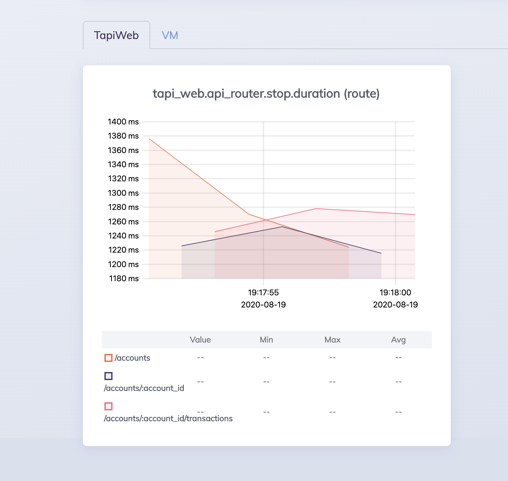

# Tapi

## Set up 🚀

If you do not already have the required versions of `erlang`, `elixir` and `nodejs`
installed, get the dependencies by doing:

```bash
mix deps.get
mix compile
npm install --prefix ./assets
```

## Hooks ⚓️

Hooks help to ensure a fast and secure development and to avoid mistakes. You
can install them by running `pre-commit install`. N.B. you will need to have
python installed already as [pre-commit](https://pre-commit.com/) is a python
package.

## Documentation 🗃

[Ex doc](https://github.com/elixir-lang/ex_doc) has been added as a dependency in
order to generate the documentation for the codebase. If you fancy reviewing the
different modules and their function run `mix docs && open doc/index.html`.

## Continuous Integration 🔁

An [Elixir CI](https://github.com/actions/setup-elixir) github action has been
set up. It runs the following tasks.

```yaml
- name: Check Source Code Formatting
  run: mix format --check-formatted

- name: Run Tests
  run: mix test --trace

- name: Run Dialyzer
  run: mix dialyzer
```

Dependencies and `plts` have been cached in order to speed up the process.

Here is the action [yaml](https://github.com/gilacost/tapi/tree/master/.github/workflows/test.yml).

## Start the application 🥳

`iex -S mix phx.server`

## Make some requests 🤘

Once you have the application started you can run `./make_some_requests.sh` and
then you will see some data in the [dashboard](http://localhost:4000/dashboard/nonode%40nohost/metrics?group=tapi_web).



## Two applications 🙋🏻‍♂️

This was meant to be a single application without phoenix and using only `plug_cowboy`,
but the metrics with the live dashboard complicated things little bit and it was easier
to keep both applications and maintain both routers. However, it could be easily
moved to a single app/router.

Current app:

```elixir
 def start(_type, _args) do
   port =
     :tapi
     |> Application.get_env(TapiWeb.Endpoint)
     |> get_in([:http, :port]) || 4000

   children = [
     TapiWeb.Telemetry,
     {Phoenix.PubSub, name: Tapi.PubSub},
     TapiWeb.Endpoint,
     {Plug.Cowboy, scheme: :http, plug: TapiWeb.ApiRouter, options: [port: port + 1]}
   ]

   Logger.info("Running TapiWeb.ApiRouter with cowboy 2.8.0 at 0.0.0.0:#{port + 1}")

   opts = [strategy: :one_for_one, name: Tapi.Supervisor]
   Supervisor.start_link(children, opts)
 end
```
